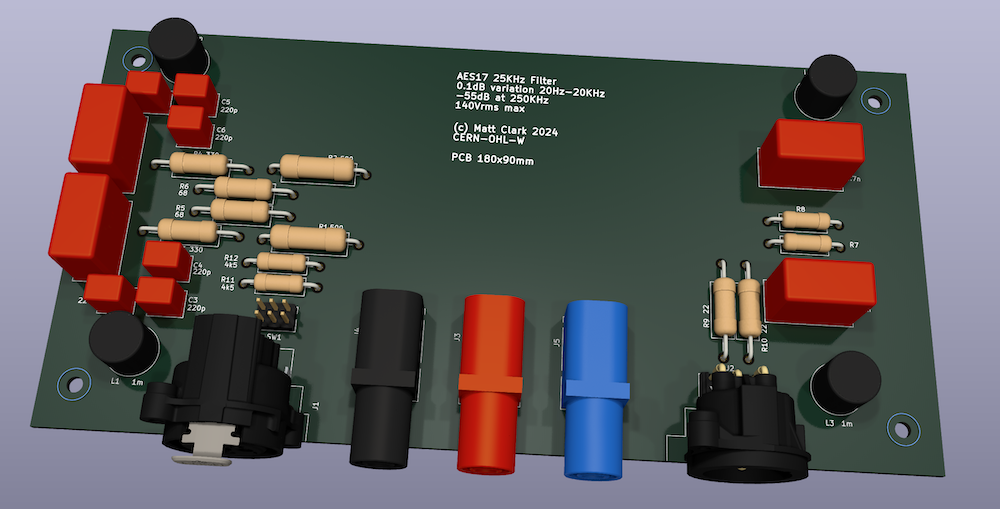
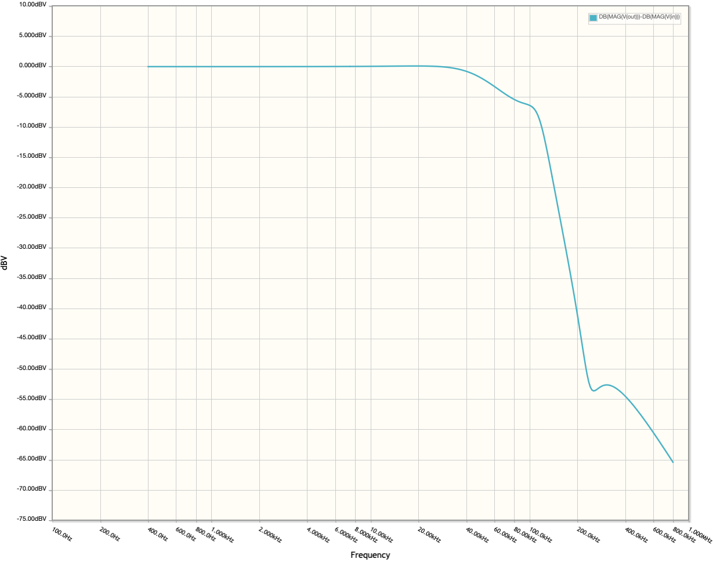

# VERSION 2 WIP

Doing:

* Space inductors out more to address excess HD3 found by @sarieri on ASR
* Move pad-down network to before filter so lower value resistors can be used
* Use 4-layer board to simplify layout
* Replace some oversized resistors with smaller 0.25W versions
* Add ground jack
* Update to KiCad 8

Maybe:
* Switch to shielded coilcraft inductors - the issue is these have 10% tolerance instead of 5%

# Goals

The goal is to make a cheap DIY passive filter for use in class D amp measurements, much like the AP AUX-0025.  The AP AUX-0025 specs as read off the [AP website](https://www.ap.com/analyzers-accessories/accessories/aux-family-switching-amplifier-measurement-filters/) are:
* Rejection > 50dB, 250 kHz to 20 MHz
* Frequency response +-0.05dB, 20Hz-20kHz
* Max input voltage 400V P-P (140Vrms)
* THD < -110dB

I also wanted the ability to pad down the output for high power measurements.  The resulting board looks like this:

# Results

- [x] Rejection > 50dB, _230_ kHz to 20 MHz
- [x] Frequency response +-0.05dB, 20Hz-20kHz
- [x] Max input voltage 400V P-P (140Vrms)
- [x] THD = _-130dB_

The simulated FR with a 100k load is on target, with -51mdBV to +51mdBV varitation from 20Hz to 20kHz, and 50dB rejection or more from 230kHz up.  The 100mdBV variation is maintained across a wide range of loads from 15k to 450k.  Measured THD is more like -130dB, so will not add to measured distortion of amplifiers, but may impact extreme resolution DAC measurements.

# Design discussion

See the design on [CircuitLab](https://www.circuitlab.com/editor/#?id=9zaq989z472b). It is inspired by the AUX-0025 but differs in a few ways.  The component values are more standard, and are reused across the design to reduce the number of different components needed.  Capacitor and inductor tolerances are 5% instead of 2.5%.  The matching to the AUX-0025 response curve is nonetheless very close.

A set of pad-down resistors allows for convenient high voltage measurements, by default giving -20dB of gain.

The load impedance should be >50kOhm for best performance, but a 10kOhm load is still +-0.1dB 20Hz-20kHz, albeit with 0.4dBV of insertion loss.

Pin 1 on each XLR socket is connected to a ground pour on the back of the PCB, as are the XLR chassis grounding pins.  This gave the best noise results for me in an all metal case.

A brief short circuit, even with a high voltage applied, should be OK. The 500R/3W input resistors can take a steady state 75Vrms indefinitely ($75V^2/1000R=5.6W$), although the inductors will clearly saturate unless a reasonable load is connected to limit the current to 800mA. The 140Vrms requirement into more reasonable loads is met by the voltage ratings of the capacitors. In the case of C1 and C2 this provides a rated 500Vpp between signal rails.

# Build tips

You will need to add your own switch to the build for the voltage divider. If not using this then jumper the connections. The BOM doesn't include the pin headers for the pad-down resistor switch connections, presumably if you are building this then you have those already.

If you want to use different components then you will need to ensure you model them from scratch, e.g. if changing the inductors you will need to model the changed series resistance.  

Case choice is up to you, as cost and availability varies a lot by location.  The omnigraffle diagram I used as a front panel drilling guide is included as a starting point.

# BOM

* R1,R2 500ohm 3W (https://au.element14.com/rcd-resistors-coils-delaylines/135-5000-fbw/wirewound-resistor-500-ohm-3w/dp/1614476)
* R3,R4 330ohm 1W (https://au.element14.com/vishay/mbe04140c3300fc100/resistor-metal-film-330r-1w-axial/dp/4140145)
* R5,R6 68ohm 1W (https://au.element14.com/te-connectivity/cfr100j68r/res-68r-5-1w-axial-carbon-film/dp/2329469)
* R7,R8 3.3k 1W (https://au.element14.com/multicomp/mcf-1w-3k3/res-3k3-5-1w-axial-carbon-film/dp/9337865)
* R9,R10 22ohm 1W (https://au.element14.com/vishay/ac01000002209ja100/res-22r-5-1w-axial-wirewound/dp/1735039)
* R11,R12 values to suit your load and desired gain reduction, use 1% tolerances. 
* C1,C2,C3,C4,C5,C6 220p 250V (https://au.element14.com/wima/fkp2o102201d00jssd/cap-220pf-1-kv-5-pp-through-hole/dp/1519285)
* C7,C8,C9,C10 4.7n 700V (https://au.element14.com/epcos/b32652a2472j000/cap-4700pf-2kv-film-radial/dp/3518977)
* L1,L2,L3,L4 1u 1ohm 800mA (https://au.element14.com/wurth-elektronik/7447480102/inductor-1000uh-5-10-5x10-5mm/dp/2211736)
* J1 XLR female NC3FAAH2 (https://au.element14.com/neutrik/nc3faah2/socket-xlr-pcb-horizontal-3pole/dp/131002301)
* J2 XLR male NC3MAAH (https://au.element14.com/neutrik/nc3maah/plug-xlr-pcb-horizontal-3pole/dp/1310044)
* J3,J4 test connectors (https://au.element14.com/cliff-electronic-components/fcr7350r/socket-pcb-4mm-r-a-s16n-pc-red/dp/1854508)

